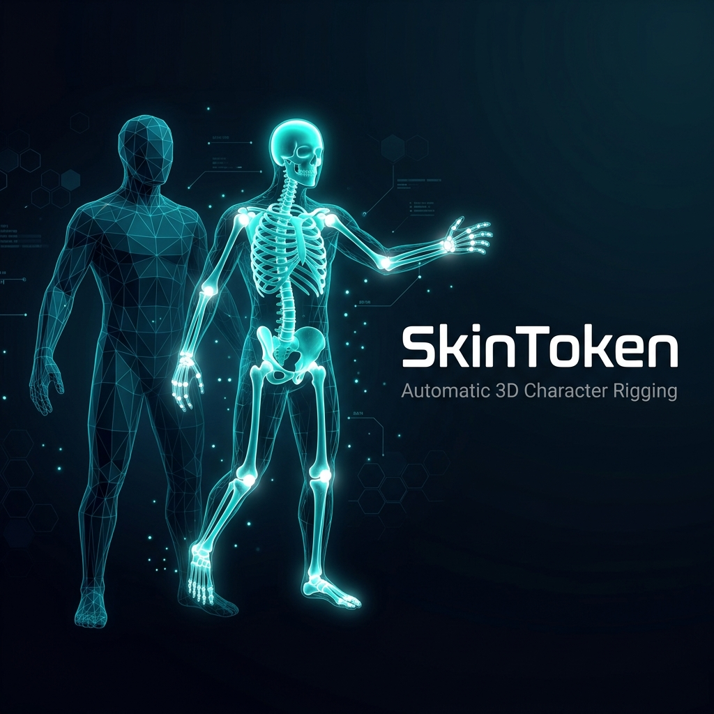

<p align="center">
  
</p>

<h1 align="center">ComfyUI-SkinToken</h1>

<p align="center">
  <strong>Automatic AI-powered 3D character rigging inside ComfyUI</strong>
</p>

<p align="center">
  <a href="#features">Features</a> •
  <a href="#installation">Installation</a> •
  <a href="#requirements">Requirements</a> •
  <a href="#nodes">Nodes</a> •
  <a href="#parameters">Parameters</a> •
  <a href="#credits">Credits</a>
</p>

---

## Overview

**ComfyUI-SkinToken** wraps [VAST-AI/SkinTokens](https://github.com/VAST-AI/SkinTokens) into ComfyUI custom nodes, enabling fully automatic skeleton generation and skinning weight prediction for arbitrary 3D character meshes. Feed it a TRIMESH input and get back a production-ready rigged GLB/FBX — no manual bone placement required.

## Features

- 🦴 **Automatic Skeleton Generation** — Predicts joint positions, hierarchy, and bone lengths from mesh geometry alone
- 🎨 **Skinning Weight Prediction** — AI-generated vertex weights with configurable groups per vertex
- 🔄 **Transfer Rigging** — Transfer a generated rig back onto the original high-detail mesh
- 📐 **Bottom Center Origin** — Automatically align the skeleton origin to the bottom-center of the mesh bounding box
- 🧹 **Auto Mesh Cleanup** — Merge vertices by distance and shade smooth by angle before export
- 🏷️ **Skeleton Templates** — Rename bones to Mixamo or Unreal Engine 5 naming conventions
- 📦 **Auto Model Download** — Checkpoints are pulled from HuggingFace on first run
- 🖥️ **Headless Blender Export** — Works without a Blender GUI via background process

## Installation

### ComfyUI Manager (Recommended)

Search for **ComfyUI-SkinToken** in ComfyUI Manager and install.

### Manual

```bash
cd ComfyUI/custom_nodes
git clone https://github.com/Rizzlord/ComfyUI-SkinToken.git
cd ComfyUI-SkinToken
pip install -r requirements.txt
```

## Requirements

| Requirement | Details |
|---|---|
| **GPU** | CUDA-capable GPU (inference runs on GPU) |
| **Blender** | Blender 4.0+ on `PATH` or set `SKINTOKEN_BLENDER_BIN` env var |
| **Python** | Python 3.10+ (ComfyUI environment) |
| **VRAM** | ~4 GB for the default checkpoint |

### Python Dependencies

```
transformers>=4.57.0
diffusers>=0.35.0
python-box
einops
omegaconf
lightning
addict
fast-simplification
trimesh
open3d
huggingface_hub
numpy>=1.26.0
scipy
```

## Nodes

### 🔽 SkinToken Download Models

Downloads the required model checkpoints from HuggingFace into `ComfyUI/models/skintoken/`.

| Output | Type | Description |
|---|---|---|
| `status` | STRING | Download result summary |
| `models_dir` | STRING | Path to the models directory |

### 🦴 SkinToken Rig

The main rigging node. Takes a TRIMESH input and outputs a rigged mesh.

| Output | Type | Description |
|---|---|---|
| `trimesh` | TRIMESH | The rigged mesh |
| `rigged_path` | STRING | File path to the exported model |
| `asset` | SKINTOKEN_ASSET | Internal asset for chaining |
| `backend` | STRING | `bpy` or `blender_headless` |

## Parameters

| Parameter | Type | Default | Description |
|---|---|---|---|
| `ckpt_name` | dropdown | `grpo_1400.ckpt` | Model checkpoint to use |
| `device` | dropdown | `auto` | Inference device (`auto` / `cuda`) |
| `save_file` | bool | `True` | Save output to the output directory |
| `filename_prefix` | string | `3D/SkinToken_` | Output filename prefix |
| `file_format` | dropdown | `glb` | Export format (`glb` / `fbx`) |
| `use_transfer` | bool | `False` | Transfer rig onto the original mesh |
| `use_postprocess` | bool | `False` | Apply voxel-based skin postprocessing |
| `group_per_vertex` | int | `4` | Max bone influences per vertex |
| `bottom_center_origin` | bool | `False` | Set skeleton origin to bottom-center of mesh |
| `smooth_angle` | float | `55.0` | Angle threshold for shade smooth |
| `skeleton_template` | dropdown | `Keep model names` | Bone naming convention |
| `top_k` | int | `5` | Top-K sampling for generation |
| `top_p` | float | `0.95` | Nucleus sampling threshold |
| `temperature` | float | `1.0` | Sampling temperature |
| `repetition_penalty` | float | `2.0` | Repetition penalty |
| `num_beams` | int | `10` | Beam search width |

## Environment Variables

| Variable | Description |
|---|---|
| `SKINTOKEN_BLENDER_BIN` | Path to the Blender binary (overrides auto-detection) |
| `SKINTOKEN_FORCE_HEADLESS` | Set to `1` to always use headless Blender export |

## Workflow

```
[Load 3D Model] → [TRIMESH] → [SkinToken Rig] → [Rigged GLB/FBX]
```

1. Load a 3D mesh as TRIMESH (using any mesh loader node)
2. Connect to **SkinToken Rig**
3. Configure skeleton template, export format, and generation params
4. Execute — the node predicts skeleton + weights and exports through Blender

## Tips

- **`use_transfer = True`** produces better results for detailed meshes — it transfers the predicted rig back onto the original geometry preserving all detail
- **`bottom_center_origin = True`** is recommended for game engine workflows (Unreal, Unity) where the pivot point should be at the character's feet
- **`skeleton_template = "Unreal Engine 5"`** maps bones to UE5 naming for direct Mannequin retargeting
- Lower **`temperature`** and higher **`num_beams`** produce more deterministic skeletons
- Increase **`group_per_vertex`** for smoother deformations at the cost of performance

## Credits

- **[SkinTokens](https://github.com/VAST-AI/SkinTokens)** by VAST-AI — the underlying rigging model
- **[Qwen3-0.6B](https://huggingface.co/Qwen/Qwen3-0.6B)** — language model backbone for token generation

## License

This node pack wraps the SkinTokens model. Please refer to the [SkinTokens repository](https://github.com/VAST-AI/SkinTokens) for model licensing terms.
